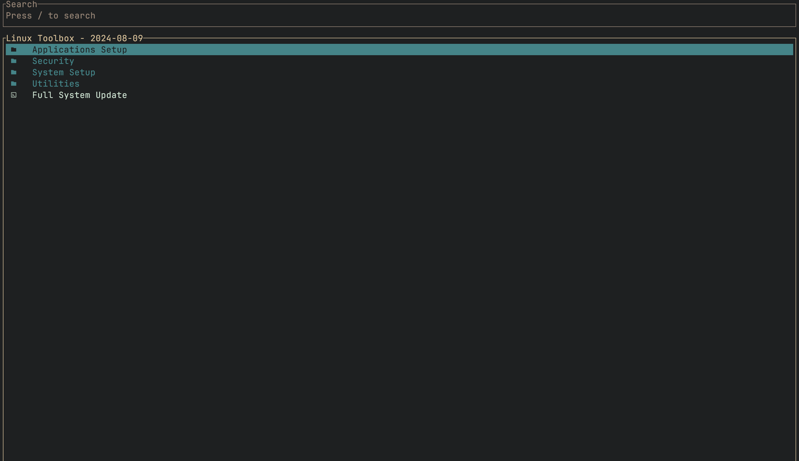

# Chris Titus Tech's Linux Utility

[](https://github.com/ChrisTitusTech/linutil/releases/latest)




**Linutil** is a distro-agnostic toolbox designed to simplify everyday Linux tasks. It helps you set up applications and optimize your system for specific use cases. The utility is actively developed in Rust 🦀, providing performance and reliability.

*Note:* Since the project is still in active development, you may encounter some issues. Please consider [submitting feedback](https://github.com/ChrisTitusTech/linutil/issues) if you do.

## 💡 Usage

To get started, open your terminal and run the following command:
```bash
curl -fsSL https://christitus.com/linux | sh
```
## 💖 Support

If you find Linutil helpful, please consider giving it a ⭐️ to show your support!

## 🎓 Documentation

For comprehensive information on how to use Linutil, visit the [Linutil Official Documentation](https://christitustech.github.io/linutil/).

## 🛠 Contributing

We welcome contributions from the community! Before you start, please review our [Contributing Guidelines](CONTRIBUTING.md) to understand how to make the most effective and efficient contributions.

## 🏅 Thanks to All Contributors

Thank you to everyone who has contributed to the development of Linutil. Your efforts are greatly appreciated, and you’re helping make this tool better for everyone!

[](https://github.com/ChrisTitusTech/linutil/graphs/contributors)

## 📜 Credits

Linutil’s Rust shell was developed by [@JustLinuxUser](https://github.com/JustLinuxUser).
